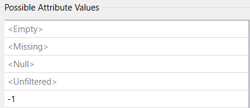
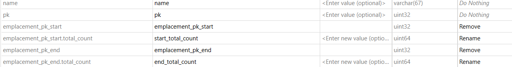

# Laboratoire 6 et 7 : ArcGIS Online, Dashboard et Experience Builder – Intégration de données
## Ce laboratoire sert à maitriser l’intégration de données dans ArcGIS Online (AGOL) et leur exploitation via Dashboard et Experience Builder. Nous allons aussi apprendre à automatiser les mises à jour avec FME.

### Intégration de données dans ArcGIS Online
Pour commencer, nous allons travailler sur FME afin de préparer les données que nous allons utiliser sur ArcGIS Online.
Ouvrir le fichier de type CSV concernant les Bixis de Montréal via un Reader.

Filtrer les données en utilisant "Attribute Filter" afin d'exclure les attributs n'ayant pas de longitude et en ajoutant -1 pour filtrer les mauvaises coordonnées.

Calculer les statistiques des données Bixis pour connaitre le flux d'entrée et de sortie des vélos par stations. Le premier pour les départs.

Grouper les données pour obtenir le total des départs par station.
Répéter l’opération pour les arrivées. (emplacement_pk_end)

Nettoyage et gestion des attributs (AttributeManager) pour les stations de Bixi
Cela afin de conserver uniquement les attributs nécessaires et garantir la cohérence des noms de champs.

Ajouter un AttributeManager.
Supprimer les attributs inutiles.
Renommer les champs pour faciliter l’intégration dans AGOL.

Sur le port UNFILTERED sortiront les stations

Jointure des données via FeatureJoiner

Afin d'associer les coordonnées aux stations pour garantir leur localisation correcte.

Ajouter un FeatureJoiner pour relier les stations aux données de départ part stations
Configurer la clé de jointure sur l’identifiant unique des stations.
Ensuite, ajouter un autre FeatureJoiner enchaîné sur le port de sortie "Joined" pour joindre les sommes des arrivées par stations.
Enfin, ajouter un Attribute manager pour nettoyer les données et renommer les attributs.
En somme, voici la finalité de traitement des départs et arrivées des stations Bixis.

Exportation des données vers ArcGIS Online

Le but sera de pouvoir publier les données sur AGOL afin de les exploiter dans un tableau de bord interactif.

Accéder à ArcGIS Online et créer un dossier GEO7630.
Aller dans Contenu , puis Mes contenus et sur la gauche créer un Dossier

Connecter FME à AGOL Writer.
Créer un nouveau Feature Service dans le dossier "Geo7630h25" précédemment crée.
Activer CREATE IF NEEDED pour la mise à jour automatique.

Une fois connecté sur ArcGIS Online, il faut ouvrir le MapViewer afin de visualiser le contenu traité sur FME.
Le MapViewer permet de visualiser dynamiquement les données et d’appliquer des styles cartographiques.
Allez à la page Contenu
Maintenant cliquez sur votre Nouveau FeatureLayer
Et cliquez sur Ouvrir dans MapViewer

Ouvrir le Feature Layer dans MapViewer.
Appliquer un style d’agrégation pour représenter les départs et arrivées.
Configurer les étiquettes pour afficher les totaux par station.

Maintenant cliquez sur Styles
Cliquez sur “+ Champ” afin d’ajouter “start_total_count” et “end_total_count”
Choisissez Comparer A à B

Cliquez sur “Options de style”
Choisissez dans l’onglet “Étiquettes” “Afficher A comme pourcentage de A et B”

Ensuite enregistrer en tant que “CARTE”

Maintenant, ouvrir le Dashboard sur la fenetre de choix des applications ArcGIS Online.
Créer un nouveau tableau de bord et choisissez le bon dossier.

Ajoutez un élément CARTE.

Et choisir la carte précédemment créee avec les clusters.
Dans réglages, choisirles options désiré.
Puis cliquer sur terminé.

Maintenant dans Mise en page (Version).
Ajouter un En-tete.

Dans CORPS 
Ajouter un élément en de type JAUGE
Avec la somme statistique des départs comme choix.
Dans généralité changez le Titre (Total des départs) et enregistrer
Maintenant faites glisser la jauge en bas de la carte.
Refaire la meme pour la somme statistique des arrivées.
Ajouter maintenant un indicateur.
Dans INDICATEUR cliquez sur ACTIVER (mise en forme avancée).
Ajouter TOPTEXT : 

      topText: 'Ratio départ / arrivée',

    et

      topTextMaxSize: 'medium',

    et 

      middleText: Round($datapoint.sum_start_total_count/$reference.sum_end_total_count,3),

Maintenant, dans données, activer Référence.
Puis, ajouter un nouvel indicateur sur le total de station à l’écran.

