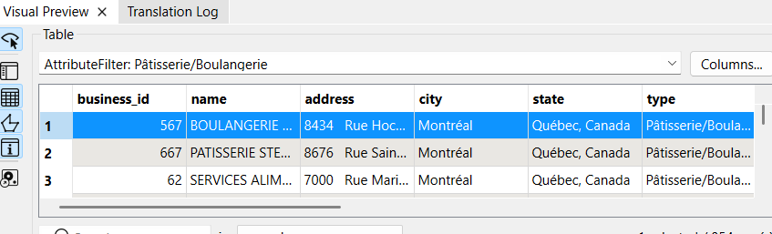
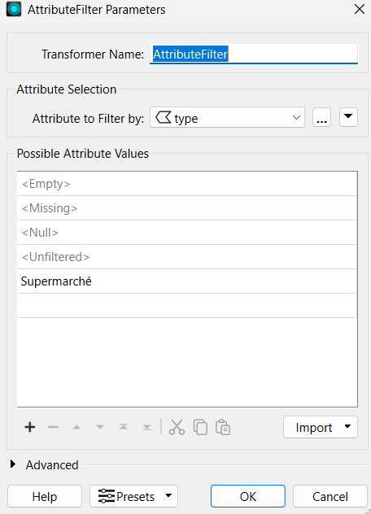
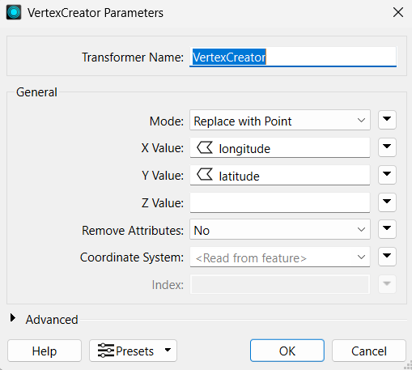
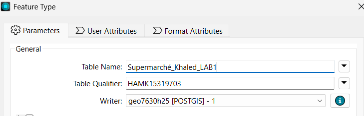
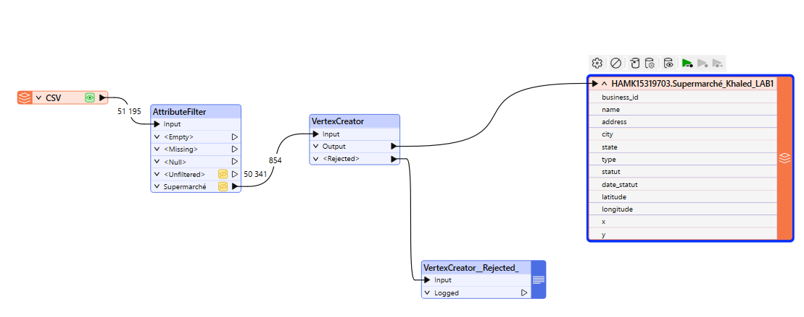
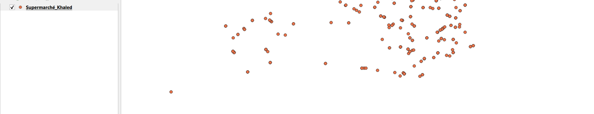
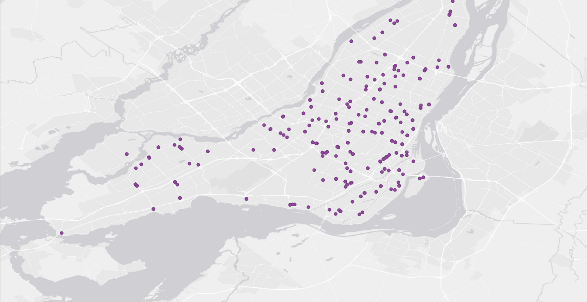
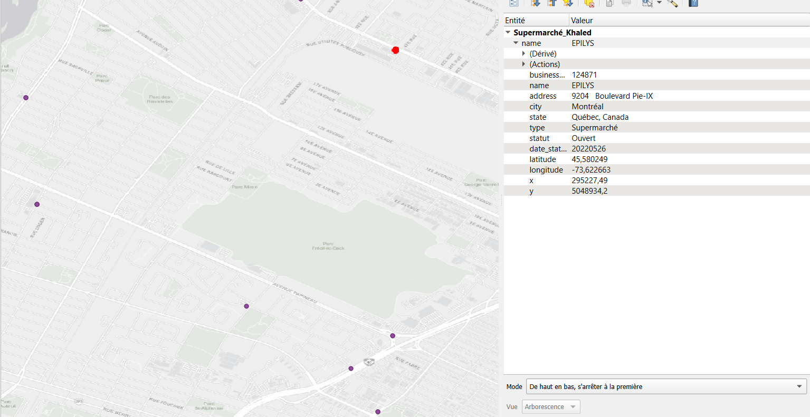

# 📚 Compte Rendu — Laboratoire 1

## 🚀 Introduction
Description des étapes suivies pour assurer le bon déroulement du **laboratoire 1**, en utilisant **FME Workbench** et **QGIS** pour traiter et visualiser des données ouvertes.

---

## 🛠️ Matériel et Méthodes

### ⚙️ Matériel utilisé
- **FME Workbench**
- **QGIS**

---

### 📅 Méthodologie

#### 📝 Étapes principales

### 1. Création d'un projet FME 📂
- Ouvrir **FME Workbench**.
- Créer un **nouveau projet**.

---

### 2. Lecture du fichier CSV 📖
- Source : **Établissements alimentaires de Montréal** via données ouvertes (adresses, longitudes, latitudes).
- Récupération de l’URL du CSV pour le connecter via un **Reader** FME.

- Ajout via **Reader** en format CSV :

✅ Connexion réussie sans erreurs !

---

### 3. Filtrage et création de points 🔍
- Utilisation du **Vertex Creator** pour créer des entités points.
- **Filtrage** : sélection des **supermarché** .

- Paramétrage du transformateur :

---

### 4. Exportation vers PostGIS 🗃️
- Exportation des données filtrées avec un **Writer PostGIS** vers la base de données.

- Résultat FME :

---

### 5. Visualisation sous QGIS 🎨
- Connexion à la base de données PostGIS dans QGIS.

- Chargement et affichage des données :

