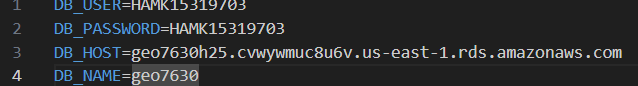
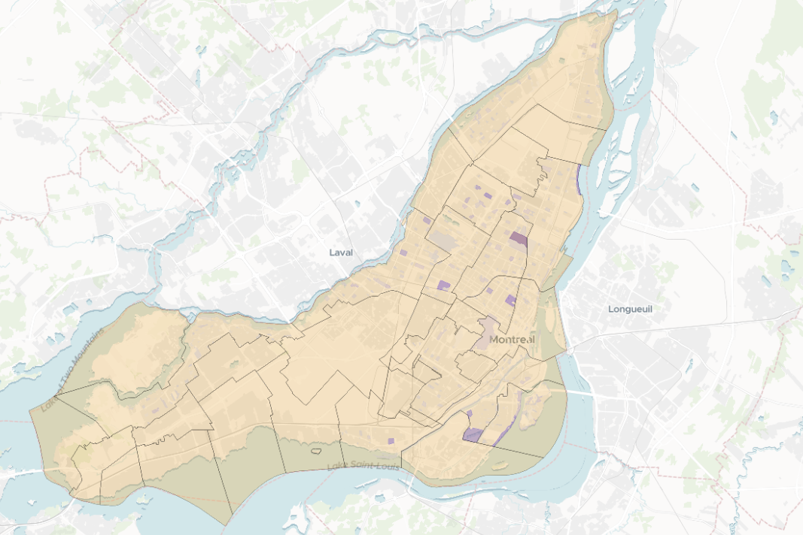

🛠️ Résumé : Laboratoire 10 - GEO7630H25
Configuration de GeoServer et mise en place de services VTS et WFS
1. 🚀 Lancement de l’environnement
Clonage du dépôt GEO7630H25 via GitHub.

Lancement d'un Codespace depuis votre fork personnel sur la branche main.

Démarrage de GeoServer pour héberger vos données géospatiales.

2. ⚙️ Configuration de l’environnement
Copier et renommer le fichier .env.example → .env.

Lancer les containers Docker via docker-compose.yml.

3. 🗺️ Ajout de contrôles à MapLibre
Intégration d'outils interactifs :

Navigation (zoom, boussole, pitch),

Géolocalisation,

Échelle métrique.

- Contrôle de navigation :
var nav = new maplibregl.NavigationControl({ showCompass: true, showZoom: true, visualizePitch: true }); map.addControl(nav, 'top-right');

- Contrôle de géolocalisation :
var geolocateControl = new maplibregl.GeolocateControl({ positionOptions: { enableHighAccuracy: true }, trackUserLocation: true }); map.addControl(geolocateControl, 'bottom-right');

- Contrôle d’échelle :
var scale = new maplibregl.ScaleControl({ unit: 'metric' }); map.addControl(scale);

4. 📦 Chargement de tuiles vectorielles

Chargement de tuiles (.pbf) dans MapLibre via une URL structurée ({z}/{x}/{y}.pbf).
Déclaration préalable de la source avant l’ajout de la couche.

5. 🎨 Style avancé
Application d’un style interpolé basé sur la quantité d’arbres (qt_arbres).

'paint': { 'fill-color': '#FF0000', 'fill-opacity': 0.5 }

Pour un style plus avancé appliqué à la couche qté d'arbres : 'paint': { 'fill-color': [ 'interpolate', ['linear'], ['get', 'qt_arbres'], 0, 'rgb(255, 255, 255)', 100, 'rgba(192, 192, 255, 0.64)', 1000, 'rgba(46, 46, 255, 0.58)', 5000, 'rgba(68, 0, 255, 0.66)', 7000, 'rgba(19, 0, 70, 0.66)' ], 'fill-opacity': 0.7 }

Utilisation d’une interpolation linéaire de couleurs selon les valeurs.

6. 🏢 Ajout d’une couche WFS
Intégration d'une couche arrondissements depuis GeoServer via un service WFS.

