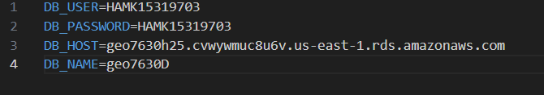
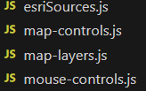
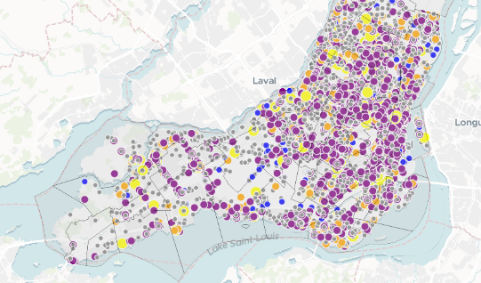
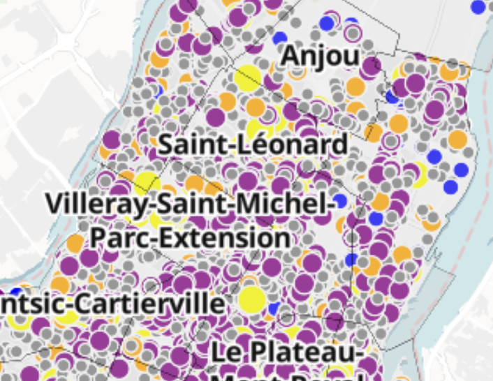

🗺️ Cartographie interactive de Montréal avec MapLibreGL
🎯 Objectif
Créer une carte interactive de Montréal affichant :

la couche de commerces,

Les limites administratifs des arrondissements.

🛠️ Préparation de l'environnement
Fichiers créés : index.html, app.js, map-layers.js, mouse-controls.js.

Utilisation de MapLibreGL et configuration Docker (pg_tileserv et pg_featureserv si nécessaire).

🗺️ Création de la carte
Fond de carte : MapTiler.

Centre : Montréal (longitude: -73.55, latitude: 45.55).

Zoom initial : 9.

Ajout des contrôles de navigation, échelle, et gestion du hash dans l'URL.

🗂️ Ajout des couches de données
Commerces (GeoJSON) : points colorés selon le type (Épicerie, Pâtisserie, Restaurant, etc.).

Arrondissements : polygones avec étiquettes.

Sources et styles définis dans map-layers.js.

🖱️ Ajout des interactions souris
Survol : changement de curseur.

Clic :

Affichage d’une popup (nom et type du commerce),

Zoom et recentrage sur le commerce sélectionné.

