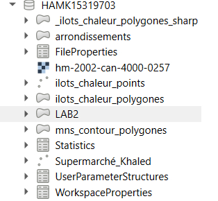
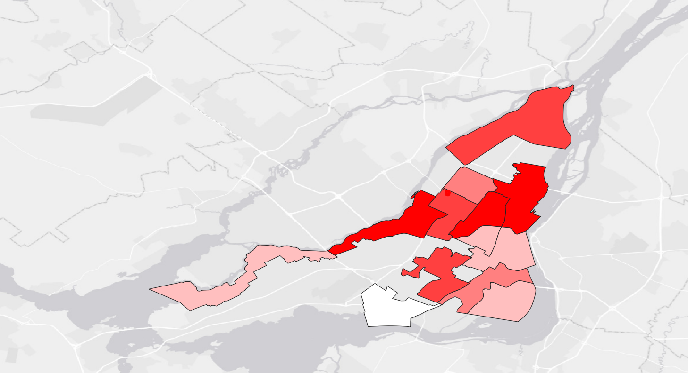
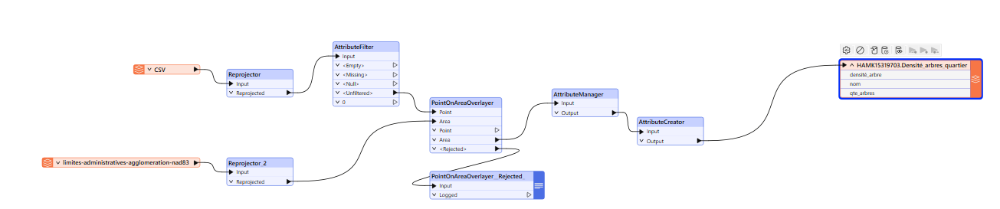

# 📚 Compte Rendu — Laboratoire 2

## 🚀 Introduction
Description des étapes suivies pour assurer le bon déroulement du **laboratoire 2**, en utilisant **FME Workbench** et **QGIS** pour un traitement spatial avancé.

---

## 🛠️ Matériel et Méthodes

### ⚙️ Matériel utilisé
- **FME Workbench**
- **QGIS**

---

### 📅 Méthodologie

#### 📝 Étapes principales

### 1. Création d'un projet FME 📂
- Ouvrir **FME Workbench**.
- Créer un **nouveau projet**.

---

### 2. Lecture des fichiers CSV et GeoJSON 📖
- **Sources** : Arbres de Montréal et Quartiers.
- Connexion via **Reader** avec liens directs (pas besoin de téléchargement manuel).

✅ Connexion réussie sans erreurs !

⚠️ **Correction d'encodage** :

✔️ Problèmes d'écriture corrigés :

---

### 3. Reprojection en MTM8 (EPSG:32188) 🗺️
- Alignement précis des couches.
- Réduction des distorsions locales.

---

### 4. Jointure spatiale (Points dans Polygones) 📌
- Utilisation de **PointOnAreaOverlayer** pour compter les arbres par quartier.

---

### 5. Nettoyage et modification des attributs 🧹
- Utilisation de **AttributeManager** pour :
  - Supprimer les attributs inutiles.
  - Renommer proprement.

---

### 6. Calcul de statistiques 📈
- Application d'une formule personnalisée :

✅ Résultat obtenu :

---

### 7. Exportation vers QGIS 🌐
- Export des résultats via **Writer PostGIS**.

---

### 8. Visualisation sous QGIS 🎨
- Chargement de la couche dans QGIS.

---

### 9. Symbologie avancée 🖌️
- Application d'un style basé sur la **quantité d'arbres** par quartier.
- Ajout d'un fond de carte **ESRI** :

---

### 10. Résultat final 🎯
- Aperçu dans FME :

---

---

