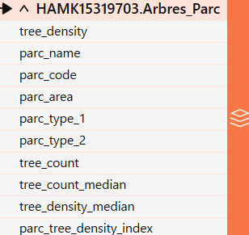
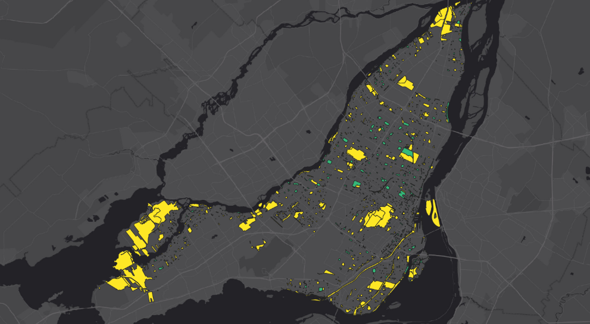
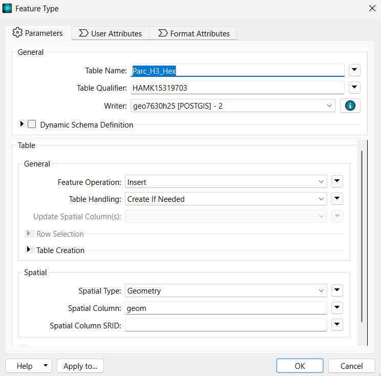
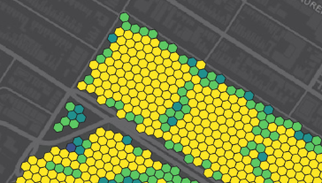

# Compte Rendu du laboratoire 3 :

### Matériel
- FME Workbench 
- QGIS

### Étapes
1. Étape 1 :Ouvrir FME et Création d'un nouveau projet :
2. Étape 2 :Lecture du CSV 

   1- Input : Arbres et Parcs de la ville de montréal 
Avec les données d'adresse,Longitude et Latitude

Ces données sont extraites du site des données ouvertes de la ville de Montréal

   Arbres en CSV ;
   

 Parcs en GeoJson ;

 
 

3. 🌍 Étape 3 : Reprojection des données

Reprojeter les couches de données (arbres et parcs) en EPSG:32188.
Utiliser le transformer Reprojector dans FME.

4. Étape 4 : Jointure spatiale
   
Pour cette étape de jointure on faire joindre chaque arbres a chaque parcs  qui le contient :

5. Étape 5 : Nettoyage :

Pour cette étape L'attribute keeper fera notre affaire

   

 
6. Étape 6 : Calcul :

l'attribute creator pour ajouter une case de calcul de densité d'arbres pour chaque parc :

Puis on calculera la mediane en utilisant le statistic calculator :

l'index de densité comme suit avec l'attribute manager :

7. Étape 7 : dernier nettoyage :
   
   Un nettoyage rigoureux garantit une base de données uniforme et fiable, en remplaçant les valeurs vides ou incorrectes par des valeurs nulles pour éviter les incohérences.
   
pour cela on va utiliser un null attribute manager

 

8. Étape 8 : Exportation vers QGIS

On exporte nos données avec le writer pour une visualisation sur QGIS 

   
9. Étape 9 : Visualisation sur QGIS

   PARTIE 2 DU LABO

   
   
10. Étape 10 : Création d’une grille hexagonale :

   on commence par connecter les données des parcs à un H3HexagonalIndexer et le configurer: 

   

11. Étape 11 : Jointure spatiale avec les arbres :

    Pour la jointure on utilisera le pointonAreaOverLayer :

    

12. Étape 12 : Selection des attributs :

    On selectionne les attributs a garder avec l'attribute Keeper

Puis on renomme un attribut :

    
13. Étape 13 : Exportation vers QGIS :

    Cela se fait avec un writer postgis
    
    

14. Étape 14 : Visualisaton QGIS :

    Aprés l'exportation on travaille sur une palette de couleur et un joli classement pour avoir le résultat suivant

    

