# 🌍 Traitement et Diffusion de Rasters avec PostgreSQL/PostGIS

## 🎯 Objectif
Développer des compétences pratiques sur :
- 📥 Lecture et traitement de rasters (TIF, GeoTIFF, PNG)
- 🛠️ Extraction de valeurs raster en données vectorielles
- 🗄️ Stockage de rasters dans PostgreSQL/PostGIS
- 🧩 Génération de tuiles raster et pyramides d'affichage
- 🔗 Association de valeurs Z aux objets vectoriels

---

## 📂 Données utilisées
➡️ [Accéder aux données du laboratoire](https://drive.google.com/drive/folders/1iRcyRWS_JiTciNdonm8leC7Nq03hRY5_?usp=sharing)

---

## 🛠️ 1. Intégration d'images aériennes

### 🔄 Reprojection
- Projection vers **EPSG:32188** avec **Reprojector**.

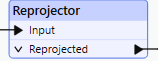

### 🧩 Extraction de métadonnées
- Utilisation de **RasterPropertyExtractor** pour récupérer dimensions, bandes et types de données.

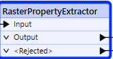

### 🌀 Rééchantillonnage
- **RasterResampler** pour diviser colonnes/rangées par 10 et réduire la résolution.

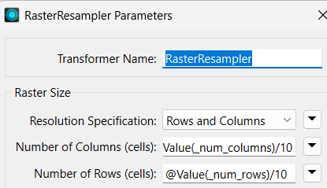

### 🧱 Création de pyramides
- **RasterPyramider** pour optimiser l'affichage rapide à différents niveaux de zoom.

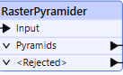

### 🖋️ FeatureWriter & Visualisation SQL
- Utilisation de **FeatureWriter** pour chaîner traitements + **SQLExecutor** pour inspection finale en base.

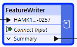  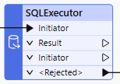
---

## 🛠️ 2. Traitement d'îlots de chaleur

### 🔄 Reprojection
- Projection vers **EPSG:32188**.

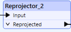

### 📐 Conversion en vecteurs
- **RasterToPolygonCoercer** pour convertir rasters en polygones (classification).

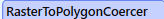 

### 🖥️ Stockage PostGIS
- Export des polygones vers une base PostGIS et visualisation dans QGIS.

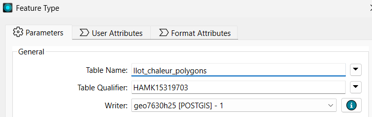

### 🎨 Amélioration visuelle
- **RasterDiffuser** (lissage) et **RasterCellValueRounder** (arrondi à 1 décimale).
- Nouvelle conversion en polygones pour une meilleure lisibilité.

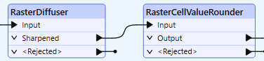

### 🔄 Conversion avancée
- **RasterCellCoercer** pour transformer en points, lignes, polygones pour analyses plus riches.

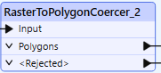
---

## 🛠️ 3. Génération de courbes de niveau depuis un MNS

### 📈 Création des courbes de niveau
- **ContourGenerator** pour générer les courbes à partir du MNS.

### ✨ Simplification
- **Generalizer** pour réduire le nombre de sommets et alléger les données.

### 🧩 Construction de surfaces
- **AreaBuilder** pour transformer les lignes de contour en polygones.

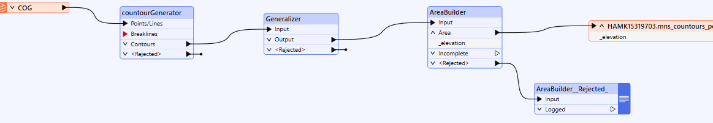

### 🖥️ Visualisation finale
- Chargement des surfaces générées dans PostGIS et visualisation dans QGIS.

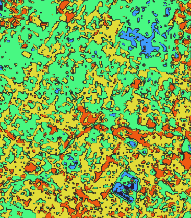

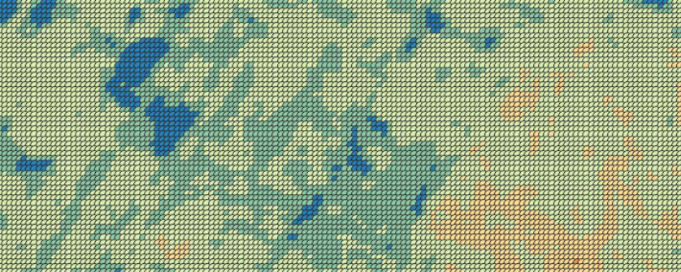

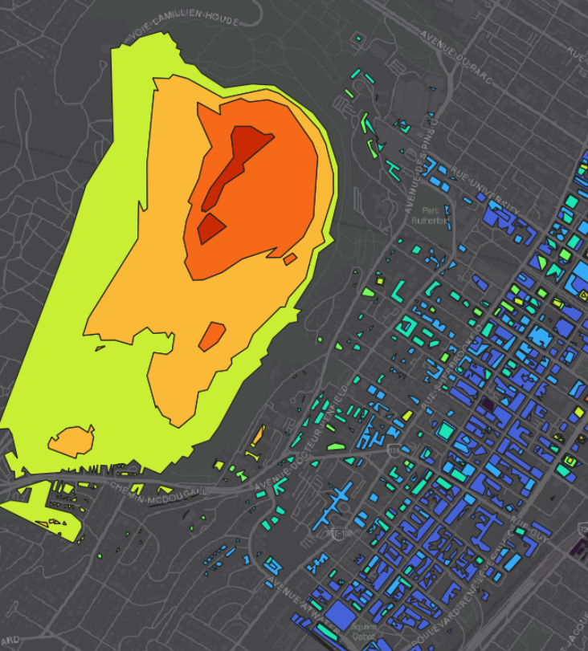

---
