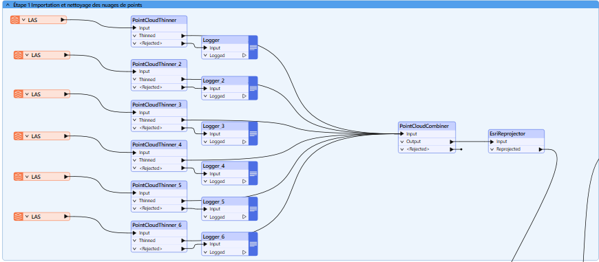
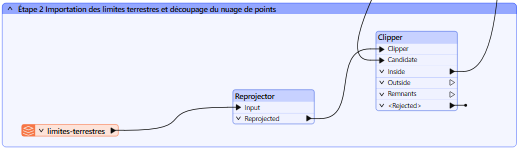
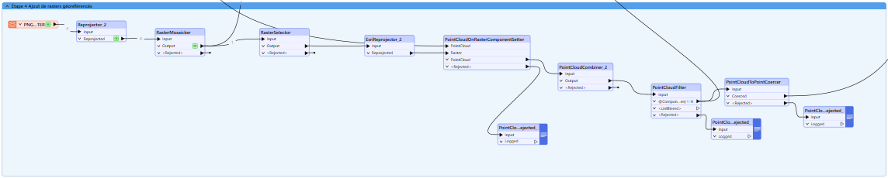
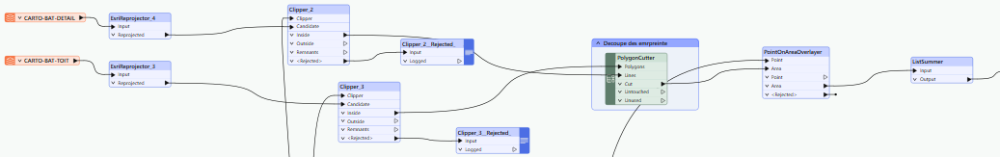
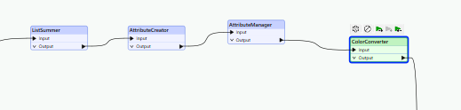
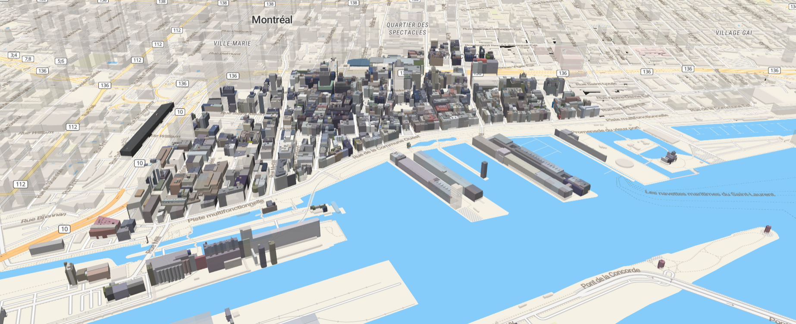

# 🛠️ Intégration et Visualisation 3D de Données Lidar et Bâtiments

## 🎯 Objectif
Créer un flux de traitement pour :
- Nettoyer et combiner des jeux de données Lidar
- Associer des rasters de couleur
- Générer des bâtiments 3D enrichis en hauteur (Z) et en couleur (RGB)
- Exporter les résultats pour une visualisation interactive sur MapLibre

---

# 1. 📥 Importation et Nettoyage du Nuage de Points Lidar

### a. Importation
- Importer les 6 fichiers Lidar en **drag and drop** ou via plusieurs Readers.

### b. Nettoyage
- Utiliser **PointCloudThinner** pour réduire la densité (`Filter Distance = 30`).

### c. Combinaison
- Fusionner tous les nuages avec **PointCloudCombiner**.

### d. Reprojection
- Reprojeter vers **EPSG:3857** avec **EsriReprojector** pour compatibilité web.

---

# 2. ✂️ Découpage par Limites Terrestres

### a. Importation des Limites
- Importer le GeoJSON des limites terrestres et reprojeter en **EPSG:3857**.

### b. Découpage
- Utiliser **Clipper** pour restreindre le nuage de points à la zone d'étude.

---

# 3. 🧹 Simplification du Nuage de Points

- Appliquer un second **PointCloudThinner** (`Filter Distance = 5`) pour alléger le nuage.

---

# 4. 🎨 Ajout de Couleurs via Rasters

### a. Importation et Mosaïque
- Importer les 4 rasters et les assembler avec **RasterMosaicker**.

### b. Sélection des Bandes
- Utiliser **RasterSelector** pour garder uniquement RGB.

### c. Association des Couleurs
- Utiliser **PointCloudOnRasterComponentSetter** pour ajouter couleurs RGB au nuage.

### d. Nettoyage Final
- Combiner les nuages (**PointCloudCombiner**) et filtrer (**PointCloudFilter**) pour ne conserver que les points valides.

### e. Transformation en Vecteurs
- Convertir le nuage en entités ponctuelles via **PointCloudCoercer**.

---

# 5. 🏢 Ajout des Bâtiments et Calculs de Hauteur

### a. Importation des Bâtiments
- Ajouter les shapefiles, reprojeter en **EPSG:3857**.

### b. Délimitation par Bounding Box
- Calculer une bounding box avec **BoundingBoxAccumulator** et découper avec **Clipper**.

### c. Découpage Fin
- Utiliser **PolygonCutter** pour affiner les géométries.

---

# 6. 🔗 Jointure des Attributs Nuage–Polygone

### a. Jointure
- Utiliser **PointOnAreaOverlayer** pour récupérer Z et RGB dans chaque polygone.

### b. Calcul des Hauteurs
- Utiliser **ListSummer** + **AttributeCreator** pour obtenir la hauteur moyenne (`z`).

### c. Nettoyage
- Nettoyer les attributs avec **AttributeManager**.

### d. Conversion des Couleurs
- Standardiser RGB/WebRGB avec **ColorConverter**.

---

# 7. 🚀 Exportation Finale et Visualisation

- Exporter le résultat en **GeoJSON**.
- Intégrer et visualiser dans **MapLibre** pour afficher les bâtiments 3D avec couleur et hauteur !

---

---

# 📸 Aperçu
