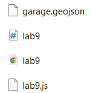
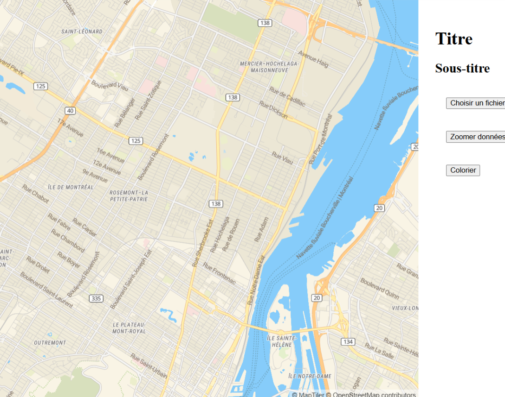
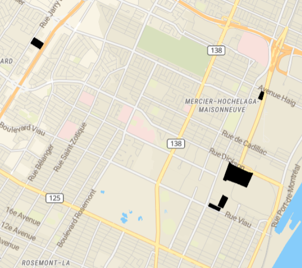
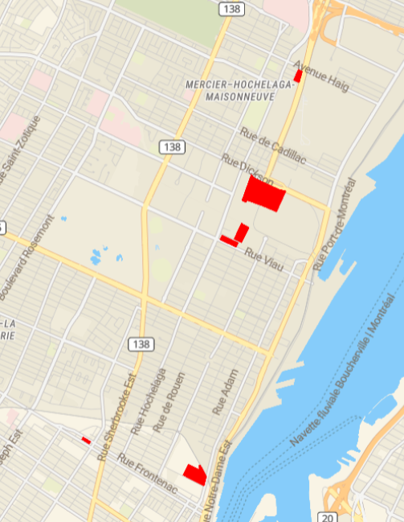
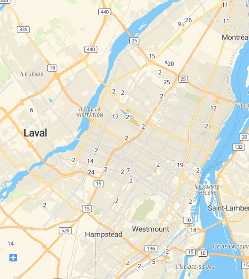

🛠️ Rapport Résumé : Laboratoire 9
📋 Pré-requis

1. 🔄 Démarrage
Clonage du dépôt principal du cours.

Création d'une branche personnelle pour travailler proprement sans impacter le dépôt principal.

2. 📦 Chargement et Vérification
Chargement des fichiers d'application existants.

Vérification de leur fonctionnement via l'ouverture du fichier HTML.

3. ✏️ Modifications Apportées
Déplacement du centre de la carte.

Changement des couleurs de la carte.

Ajout d'un GeoJSON représentant une couche vectorielle.

4. 🎨 Améliorations
Création d'un fichier Randomcolor.js pour appliquer des couleurs aléatoires aux entités du GeoJSON.

Ajout d'étiquettes dynamiques pour chaque polygone afin d'afficher des informations interactives.

5. 🏆 Résultats Obtenus
Personnalisation complète de la carte.

